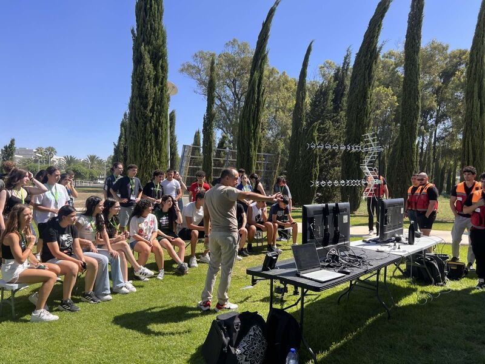
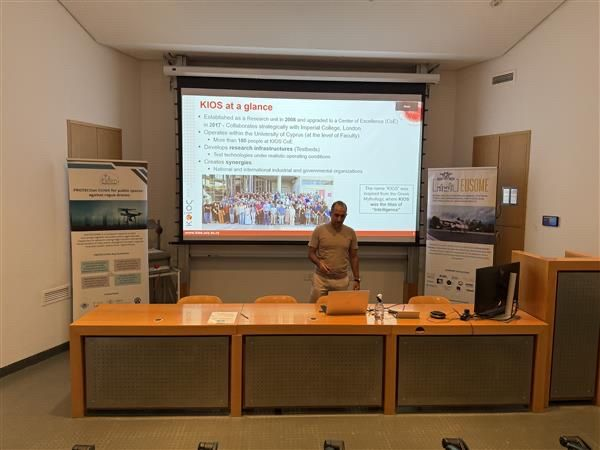

Our project partner, the SocialTech Lab, proudly promoted the EUSOME Project at the second edition of the New European Bauhaus in Regions and Cities event, hosted at URsquare and the European Parliament on 29-30 September 2025, in hashtag. More than 400 participants - including NEB Prize finalists, NEB Boost recipients, project promoters, and local and regional authorities - came together to exchange ideas on how to make Europe’s regions more sustainable, inclusive, and beautiful. We were especially proud to see STL’s Social Impact Generator (The Base by CyprusInno) showcased as a finalist in the NEB Prizes 2025 - Champions: Regaining a Sense of Belonging category! Congratulations to our partners for inspiring contributions to Europe’s NEB vision.EUSOME Project partners :KIOS Research and Innovation Center of Excellence, Hellenic U-space Institute, Athena Research Center, Hellenic Ministry of Digital Governance, Cyprus Ministry of Transport, Communications and Works, Hellenic Drones S.A., Hellenic Civil Aviation Authority, Aviomania Aircraft, GRNET - Greek Research & Technology Network, Cyprus Chamber of Commerce & Industry, Adrestia R&D, Centrum Badań Kosmicznych Polskiej Akademii Nauk, SocialTech Lab, Institute Mihajlo Pupin, EPIRUS - Perifereia Ipeirou, and Mediterranean Adventure Ltd.hashtag hashtag hashtag hashtag hashtag hashtag hashtag hashtag hashtag hashtag hashtag hashtag hashtag hashtag hashtag hashtag hashtag

