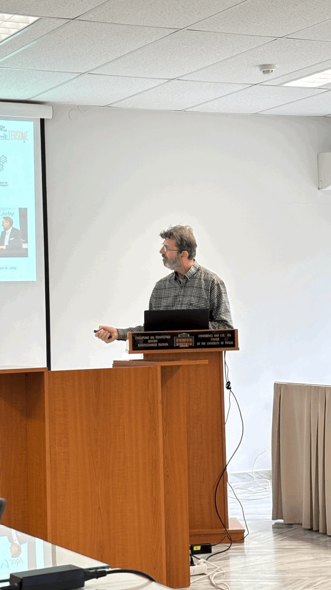
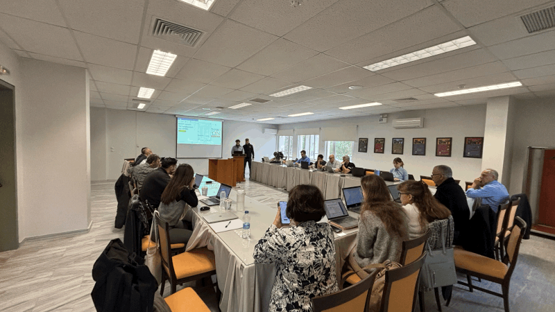

A highlight from 2025: EUSOME at Oshkosh!Back in July 2025, the Aviomania Aircraft team had the chance to showcase the EUSOME Project vision at EAA AirVenture Oshkosh 2025 in Wisconsin, USAAt their dedicated booth, our partners presented a 3D-printed model of their hashtag concept and shared insights into the EUSOME project’s goals and key technological innovations. It was a fantastic opportunity to connect with aviation enthusiasts, exchange ideas, and discuss the future of urban and personal air mobility. The conversations and feedback received at Oshkosh continue to shape our work today, supporting the ongoing development of flexible, lightweight, mission-ready eVTOL designs. EUSOME Project partners :KIOS Research and Innovation Center of Excellence, Hellenic U-space Institute, Athena Research Center, Hellenic Ministry of Digital Governance, Cyprus Ministry of Transport, Communications and Works, Hellenic Drones S.A., Hellenic Civil Aviation Authority, Aviomania Aircraft, GRNET - Greek Research & Technology Network, Cyprus Chamber of Commerce & Industry, Adrestia R&D, Centrum Badań Kosmicznych Polskiej Akademii Nauk, SocialTech Lab, Institute Mihajlo Pupin, EPIRUS - Perifereia Ipeirou, and Mediterranean Adventure Ltd.hashtag hashtag hashtag hashtag hashtag hashtag hashtag hashtag hashtag hashtag hashtag hashtag hashtag hashtag hashtag hashtag hashtag

