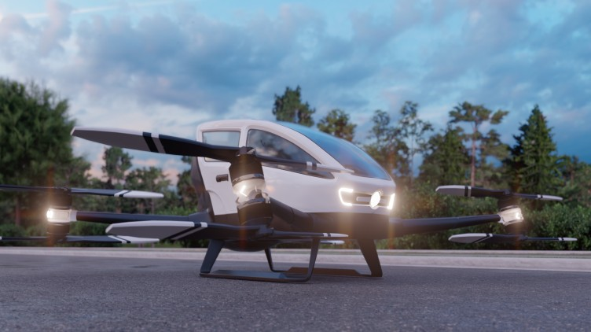

Join our Science Café on Advanced Air Mobility (hashtag)On 28 January 2026, join EUSOME project partners SocialTech Lab and KIOS Research and Innovation Center of Excellence at the University of Cyprus for an interactive Science Caféon drones and Advanced Air Mobility.This is an open space where everyone can learn, discuss, and share their perspective on how drones can support healthcare, emergency response, sustainability, and more. UCY Engineering Faculty, POL 10 - Amphitheatre B102 “Elias Kyriakides” 16:00 - 18:00 Register by 25 January: https://lnkd.in/gWNbGinpEUSOME Project partners :KIOS Research and Innovation Center of Excellence, Hellenic U-space Institute, Athena Research Center, Hellenic Ministry of Digital Governance, Cyprus Ministry of Transport, Communications and Works, Hellenic Drones S.A., Hellenic Civil Aviation Authority, Aviomania Aircraft, GRNET - Greek Research & Technology Network, Cyprus Chamber of Commerce & Industry, Adrestia R&D, Centrum Badań Kosmicznych Polskiej Akademii Nauk, SocialTech Lab, Institute Mihajlo Pupin, EPIRUS - Perifereia Ipeirou, and Mediterranean Adventure Ltd.hashtag hashtag hashtag hashtag hashtag hashtag hashtag hashtag hashtag hashtag hashtag hashtag hashtag hashtag hashtag hashtag hashtag

