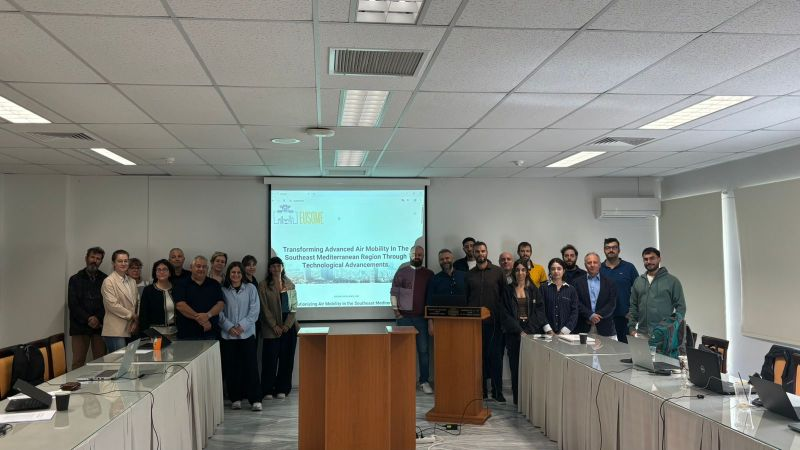
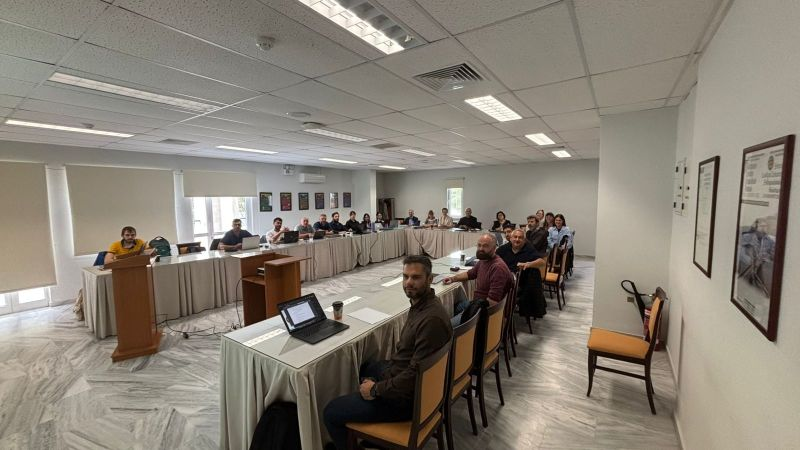
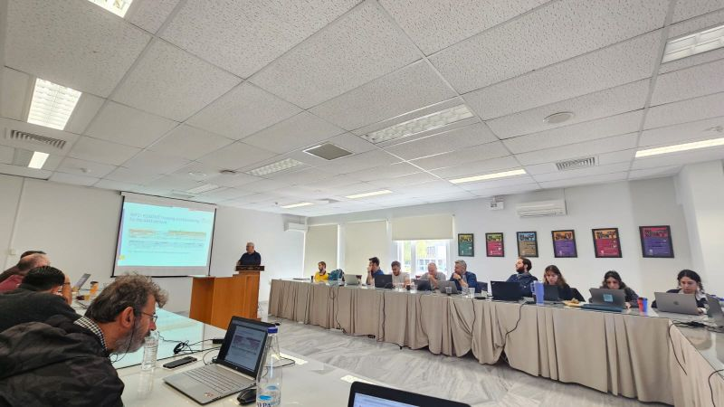
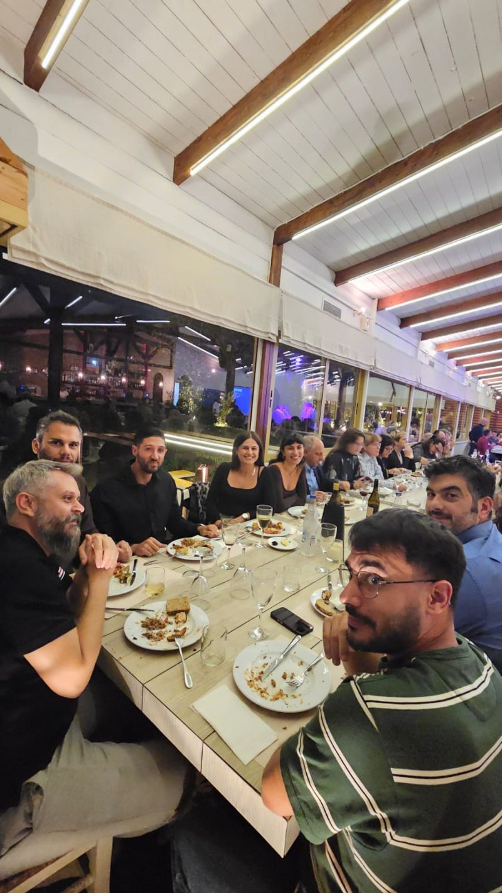

Our 1st Science Café!The Science Café on Advanced Air Mobility (hashtag) took place at the University of Cyprus on the 28th of January and brought together students, researchers, and professionals to explore how drones can serve society and the public good Through open discussions, live polls, and hands-on exercises, the focus went beyond the tech. Participants talked about responsible use, real community needs, and how people can play an active role in shaping the future of AAM The event was organised by SocialTech Lab and the KIOS Research and Innovation Center of Excellence, as part of the public outreach activities of the EUSOME Project.More open, participatory AAM dialogues are coming!Stay tuned EUSOME Project partners :KIOS Research and Innovation Center of Excellence, Hellenic U-space Institute, Athena Research Center, Hellenic Ministry of Digital Governance, Cyprus Ministry of Transport, Communications and Works, Hellenic Drones S.A., Hellenic Civil Aviation Authority, Aviomania Aircraft, GRNET - Greek Research & Technology Network, Cyprus Chamber of Commerce & Industry, Adrestia R&D, Centrum Badań Kosmicznych Polskiej Akademii Nauk, SocialTech Lab, Institute Mihajlo Pupin, EPIRUS - Perifereia Ipeirou, and Mediterranean Adventure Ltd.hashtag hashtag hashtag hashtag hashtag hashtag hashtag hashtag hashtag hashtag hashtag hashtag hashtag hashtag hashtag hashtag hashtag

