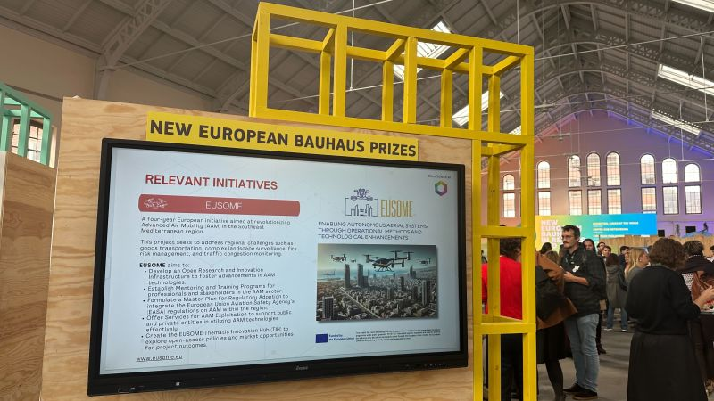
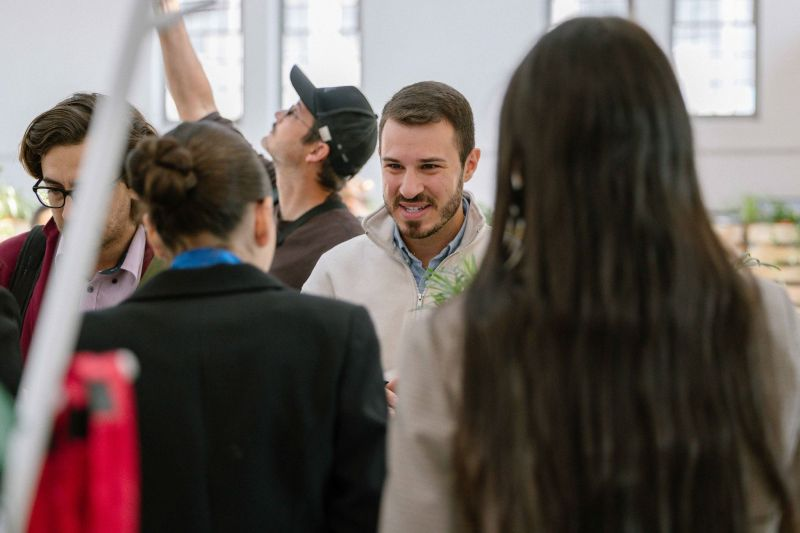
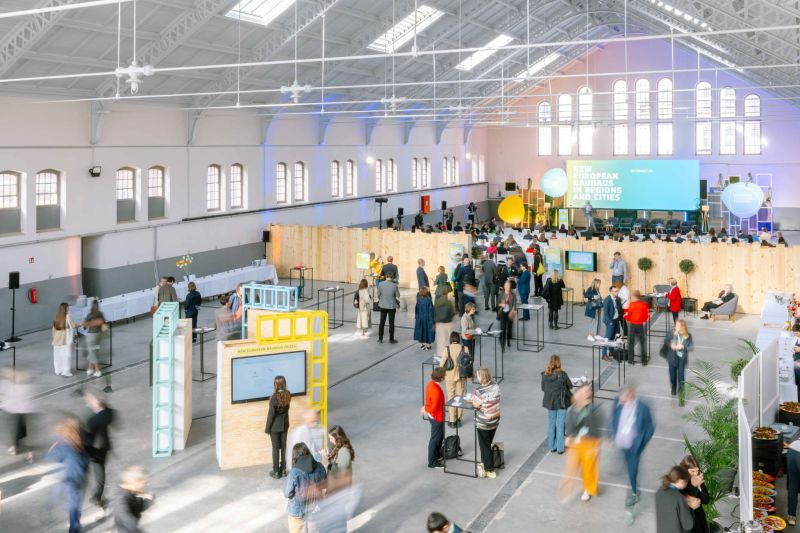

Throwback to the 2nd EUSOME Project study visit in hashtag On 25-26 November, project partner Institute Mihajlo Pupin in Belgrade hosted the second study visit of the EUSOME Mentoring & Training Programme. The visit brought together partners from project coordinator KIOS Research and Innovation Center of Excellence of the University of Cyprus and project partner the Centrum Badań Kosmicznych Polskiej Akademii Nauk, along with Serbian stakeholders, to exchange views on the future of Advanced Air Mobility (hashtag) in the region Constructive discussions with representatives of the Civil Aviation Directorate of the Republic of Serbia, the Emergency Management Sector of Serbia and Post of Serbia focused on the current hashtag regulatory framework in Serbia and the practical requirements for enabling AAM operations. The programme also included a visit to IMP-Computer Systems Ltd., where participants were introduced to advanced simulation and unmanned aircraft control systems, highlighting the technological capabilities supporting future applications Through this kind of mentoring activities and stakeholder dialogue, the EUSOME programme continues to strengthen regional cooperation and align innovation with real operational needs EUSOME Project partners :KIOS Research and Innovation Center of Excellence, Hellenic U-space Institute, Athena Research Center, Hellenic Ministry of Digital Governance, Cyprus Ministry of Transport, Communications and Works, Hellenic Drones S.A., Hellenic Civil Aviation Authority, Aviomania Aircraft, GRNET - Greek Research & Technology Network, Cyprus Chamber of Commerce & Industry, Adrestia R&D, Centrum Badań Kosmicznych Polskiej Akademii Nauk, SocialTech Lab, Institute Mihajlo Pupin, EPIRUS - Perifereia Ipeirou, and Mediterranean Adventure Ltd.hashtag hashtag hashtag hashtag hashtag hashtag hashtag hashtag hashtag hashtag hashtag hashtag hashtag hashtag hashtag hashtag hashtag

