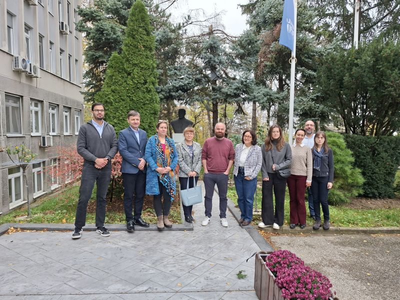
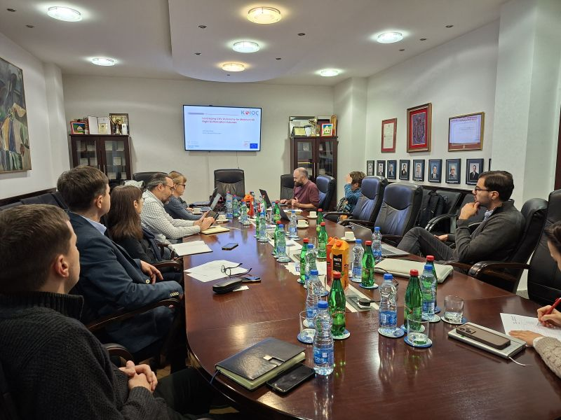
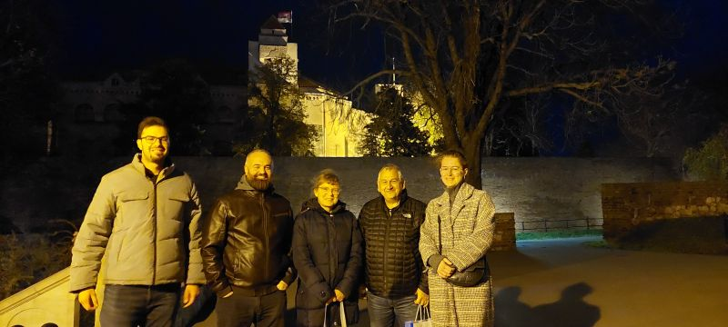
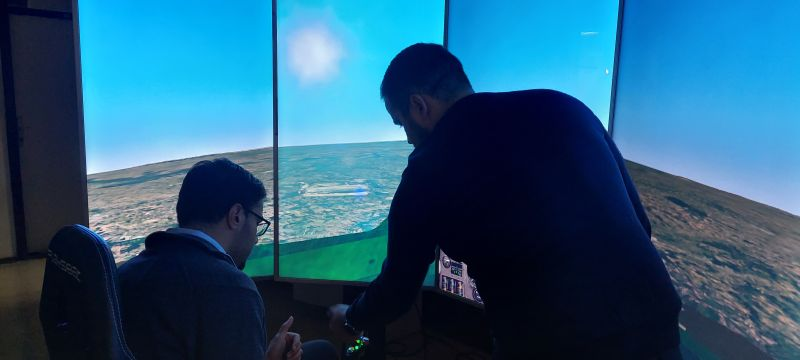

Exploring hashtag#5G connectivity for hashtag operationsWithin the EUSOME Project, partners from the Industrial Systems Institute / Research Centre ATHENA and Hellenic Drones S.A. recently carried out drone flights to measure 5G signal strength at different altitudes in urban environments.The objective was to better understand how buildings and other terrestrial obstacles affect connectivity in the airspace where drones typically operate (around 20-60 meters).The measurements collected during these flights will help improve how UAV missions are planned, supporting safer and more reliable drone operations for applications such as inspections, environmental monitoring, and emergency response.Advancing connectivity awareness is an important step toward enabling scalable drone operations in the smart cities of the future. EUSOME Project partners :KIOS Research and Innovation Center of Excellence, Hellenic U-space Institute, Athena Research Center, Hellenic Ministry of Digital Governance, Cyprus Ministry of Transport, Communications and Works, Hellenic Drones S.A., Hellenic Civil Aviation Authority, Aviomania Aircraft, GRNET - Greek Research & Technology Network, Cyprus Chamber of Commerce & Industry, Adrestia R&D, Centrum Badań Kosmicznych Polskiej Akademii Nauk, SocialTech Lab, Institute Mihajlo Pupin, EPIRUS - Perifereia Ipeirou, and Mediterranean Adventure Ltd.hashtag hashtag hashtag hashtag hashtag hashtag hashtag hashtag hashtag hashtag hashtag hashtag hashtag hashtag hashtag hashtag hashtag

