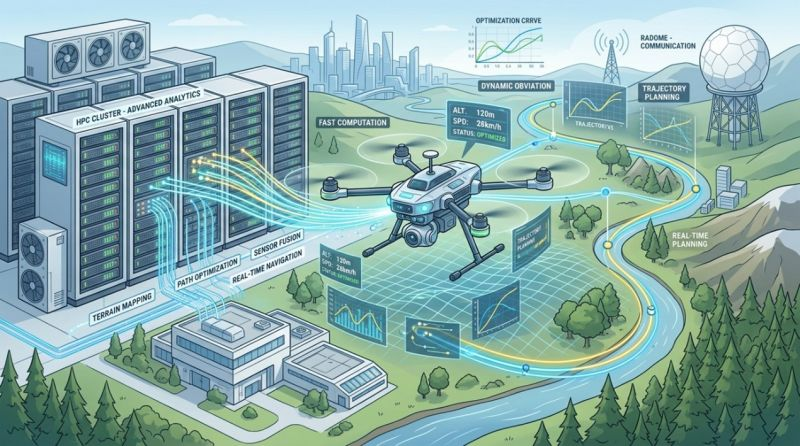

Did you know that integrating drones safely into hashtag is not only a regulatory challenge, but also a computational one?To build realistic Digital Twins of hashtag operations in complex urban environments, we need to simultaneously model several systems: Terahertz & mmWave propagation across dense 3D city geometries using ultra-massive MIMO systems Multimodal AI sensor fusion (Vision + Radar) that remains reliable even in low-visibility conditions Large-scale trajectory optimization that guarantees safe and energy-efficient UAV flight Each of these challenges quickly explodes in complexity - reaching tens of millions of unknowns, massive GPU memory requirements, and millions of optimization constraints. This is where High-Performance Computing (hashtag) becomes the enabler in the EUSOME Project. With access to ARIS HPC systems and NVIDIA A100 GPU nodes, researchers can move beyond simplified models and start building high-fidelity Digital Twins capable of supporting real-world autonomous UAV operations. The EUSOME project aims to bridge this gap between theoretical research and deployable airspace systems, supporting the future of U-space and autonomous aviation in Europe. Excited to push this forward within the Horizon Europe ecosystem. EUSOME Project partners :KIOS Research and Innovation Center of Excellence, Hellenic U-space Institute, Athena Research Center, Hellenic Ministry of Digital Governance, Cyprus Ministry of Transport, Communications and Works, Hellenic Drones S.A., Hellenic Civil Aviation Authority, Aviomania Aircraft, GRNET - Greek Research & Technology Network, Cyprus Chamber of Commerce & Industry, Adrestia R&D, Centrum Badań Kosmicznych Polskiej Akademii Nauk, SocialTech Lab, Institute Mihajlo Pupin, EPIRUS - Perifereia Ipeirou, and Mediterranean Adventure Ltd.hashtag hashtag hashtag hashtag hashtag hashtag hashtag hashtag hashtag hashtag hashtag hashtag hashtag hashtag hashtag hashtag hashtag hashtag hashtag hashtag hashtag hashtag

