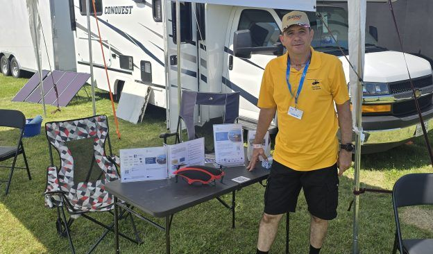
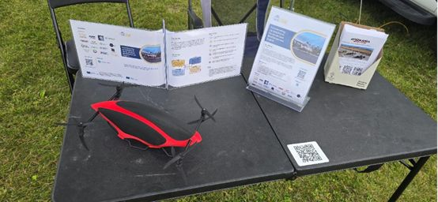

On 3 February, the Institute Mihajlo Pupin once again hosted project partners, within the framework of the 3rd and final study visit of the EUSOME Project Mentoring Programme in Belgrade!The meeting brought together partners from the KIOS Research and Innovation Center of Excellence of the University of Cyprus, the Centrum Badań Kosmicznych Polskiej Akademii Nauk, the Athena Research Center, and Hellenic Drones S.A., alongside the IMP research team. Discussions focused on identifying concrete opportunities to further develop the EUSOME initiative and exploring future directions aligned with the project’s strategic priorities. Particular emphasis was placed on aligning upcoming activities with relevant funding frameworks and broader regional development objectives. Step by step, the study visits strengthened cooperation across the South-East Mediterranean ecosystem, shaping a sustainable path forward for Advanced Air Mobility (hashtag) EUSOME Project partners :KIOS Research and Innovation Center of Excellence, Hellenic U-space Institute, Athena Research Center, Hellenic Ministry of Digital Governance, Cyprus Ministry of Transport, Communications and Works, Hellenic Drones S.A., Hellenic Civil Aviation Authority, Aviomania Aircraft, GRNET - Greek Research & Technology Network, Cyprus Chamber of Commerce & Industry, Adrestia R&D, Centrum Badań Kosmicznych Polskiej Akademii Nauk, SocialTech Lab, Institute Mihajlo Pupin, EPIRUS - Perifereia Ipeirou, and Mediterranean Adventure Ltd.hashtag hashtag hashtag hashtag hashtag hashtag hashtag hashtag hashtag hashtag hashtag hashtag hashtag hashtag hashtag hashtag hashtag

